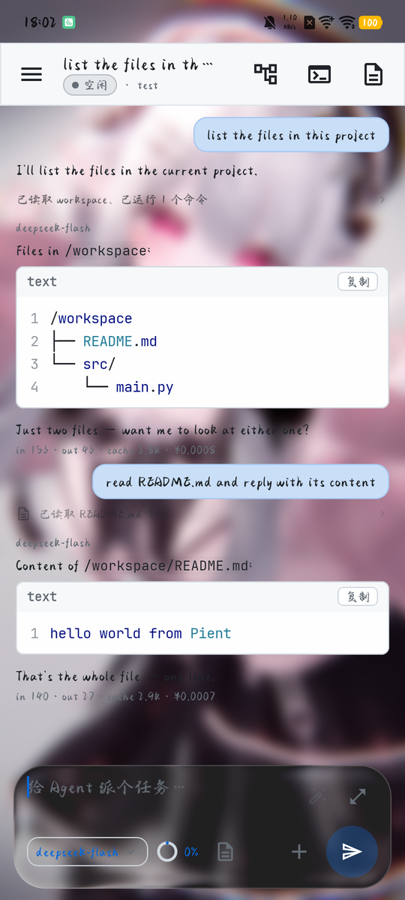
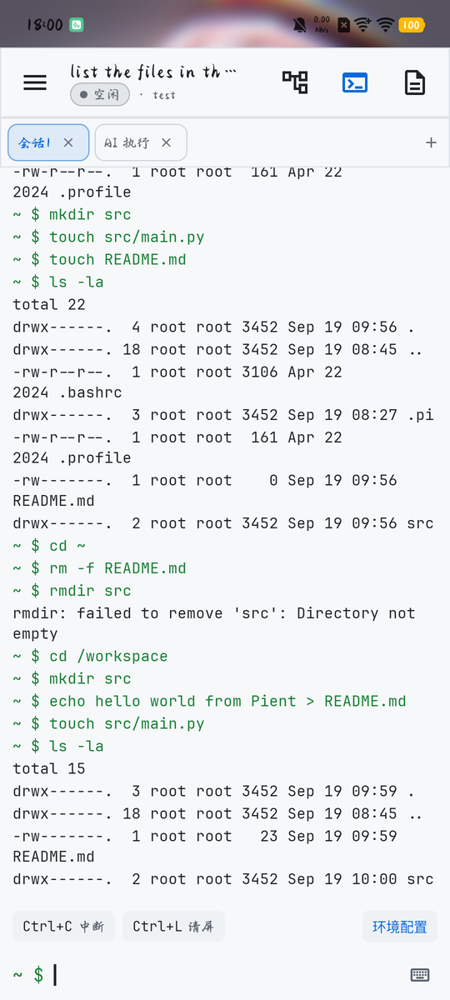
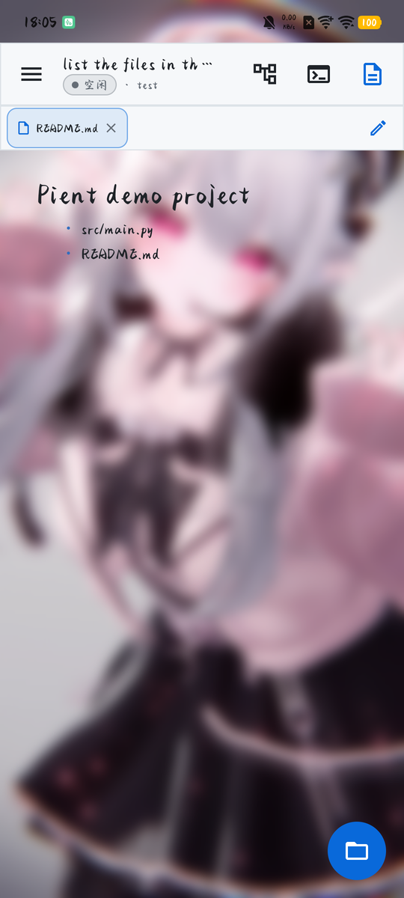
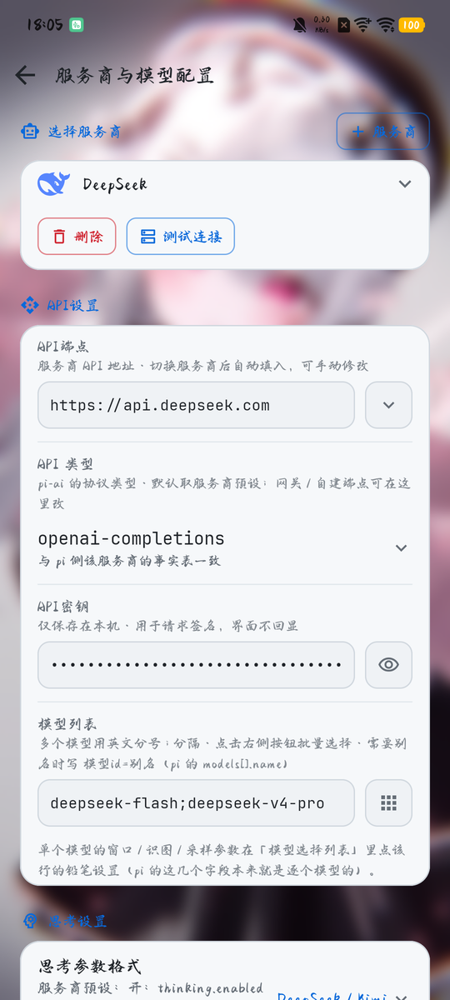
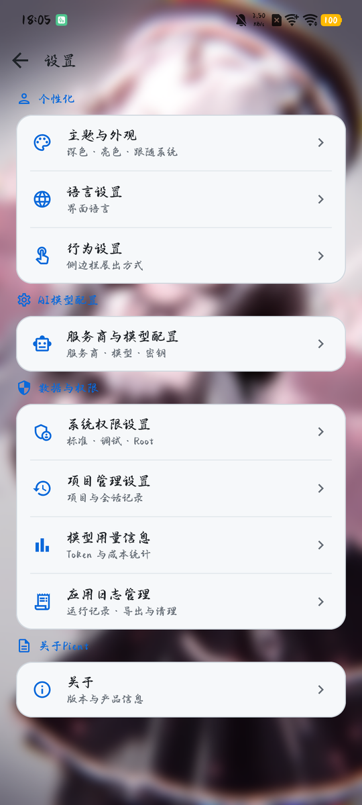
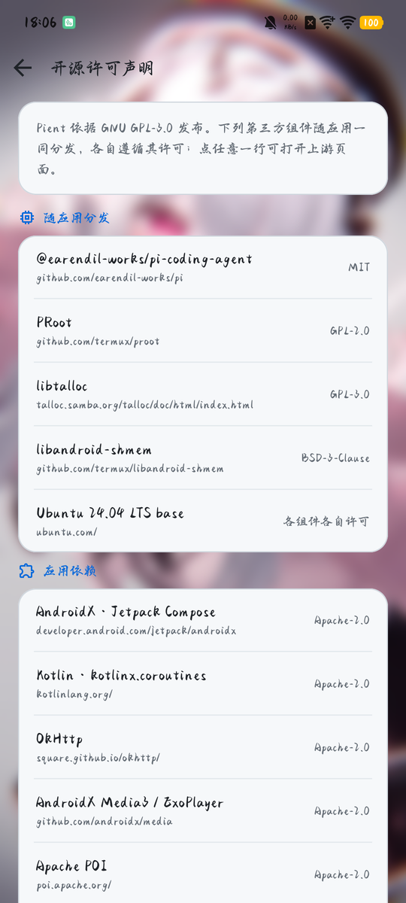

<div align="center">


# Pient

**基于 [Pi Agent](https://github.com/earendil-works/pi) 的 Android 原生 AI Agent 工作台**

[](https://github.com/Jay-Victor/Pient/releases)
[](LICENSE)
[](https://github.com/Jay-Victor/Pient/releases)

[English](README.en.md) · [下载](#下载与安装) · [从源码构建](#从源码构建) · [架构速览](#架构速览) · [Gitee 镜像](https://gitee.com/Jay-Victor/Pient)

</div>

---

## 这是什么

Pient = **Pi** + **Agent**。它把 [Pi Agent](https://github.com/earendil-works/pi) 完整搬到 Android 上：界面是原生 Jetpack Compose，AI 侧的运行时是**随包预置的 pi 官方包，跑在应用内置的 Ubuntu 环境里**。应用只通过 pi 的官方 RPC（`pi --mode rpc`，JSONL）与它通信，不发明中间协议。

所以对话、工具（读写文件 / 执行命令 / 检索）、会话与上下文管理都由 pi 原生承担；Pient 负责补上它缺的那一层 —— **Android 上的界面、终端、文件与系统能力**：

- 应用 ↔ 一个 pi 子进程，一跳到位
- 内置 Ubuntu 24.04（默认 PRoot，Root 时走 chroot），不需要额外下载整个 Linux 系统，也不需要 Termux
- 工作区 = 你当前打开的项目文件夹，AI 与终端都落在那里

> 仍在活跃开发中；最新版本与下载见 [Releases](https://github.com/Jay-Victor/Pient/releases)。

## 特性

**对话与分支**

- 流式回答、思考过程与档位、工具调用卡片；Markdown / 表格 / 代码高亮 / LaTeX 公式渲染
- 消息动作：从此处创建新会话（pi 原生 fork）、复制消息（纯文本 / Markdown / XML 三种粒度）、引用追问
- 分支画布：把会话的分支结构画成节点树，可在任意节点上重新分支

**终端与执行环境**

- 终端页：每个会话一个常驻 Ubuntu 会话，多标签
- 环境配置：apt 镜像选择、Node.js / Python 等运行时按需安装、pi 版本管理
- Android shell 通道：Shizuku（调试权限）或 `su`（Root）以系统身份执行命令，AI 侧同样可调用

**文件**

- 项目文件树：新建 / 重命名 / 删除 / 搜索，SAF 与直连文件系统双通道
- 预览与编辑：代码高亮与行号、Markdown 渲染 / 源码编辑、图片、音视频播放、docx / xls(x) 转文本
- 输入栏 `@` 文件引用与 `/` 命令卡（扩展命令 / 提示模板 / 技能）

**模型与服务商**

- 服务商与模型配置：内置 30+ 家服务商目录，逐模型设置上下文窗口 / 最大输出 / 思考 / 采样参数，「测试连接」逐模型真实探测
- 模型用量与成本统计（Token 与费用），定价表随包内置
- 思考档位直通 pi（按 pi 报的可用档位渲染）

**界面与系统**

- Material 3 + 磨砂 / 液态玻璃材质；主题模式、配色方案、字体、背景图可定制
- 8 种界面语言：简体中文 / 繁體中文 / English / 日本語 / Español / Français / Português / हिन्दी
- 三档系统权限：标准 / 调试（Shizuku）/ Root
- 应用日志管理与导出、后台保活、关于页「检查更新」+ 应用内下载安装

## 界面截图

| 对话与工具调用 | 分支画布 |
| --- | --- |
|  |  |
| 打开项目就能派任务：工具调用、文件树、用量统计都在消息流里 | 会话的分支结构画成节点树，蓝线 = 当前活跃路径 |

| 终端（内置 Ubuntu 24.04） | 文件树 |
| --- | --- |
|  |  |
| 每个会话一个常驻 shell；AI 执行的命令另有只读镜像标签页 | 项目的真实文件系统：新建 / 重命名 / 导入导出 / 刷新 |

| 文件预览 | 服务商与模型配置 |
| --- | --- |
|  |  |
| Markdown 走 GFM 渲染、一键切源码编辑；代码带行号与高亮 | 内置服务商目录，逐模型参数、端点与连接测试 |

| 设置 | 开源许可声明 |
| --- | --- |
|  |  |
| 主题外观、语言、行为、模型、数据与权限、关于 | 随应用分发的第三方组件清单与 GPL-3.0 全文 |

## 下载与安装

| 平台 | 地址 |
| --- | --- |
| GitHub Releases | <https://github.com/Jay-Victor/Pient/releases> |
| Gitee Releases（国内） | <https://gitee.com/Jay-Victor/Pient/releases> |

- 要求 **Android 8.0（API 26）及以上**，**仅支持 arm64-v8a**（现役绝大多数真机）
- 安装包约 71 MB：已包含 Ubuntu 根文件系统与 pi 运行时，装完即可起步
- 已安装的用户可以直接用应用内「关于 → 检查更新」下载并升级

## 首次使用

1. **建项目**：对话页侧栏 → 新建项目，选一个文件夹作为工作区
2. **配模型**：设置 → 服务商与模型配置，填 API Key → 「测试连接」→ 选好服务商与模型
3. **装运行时**：设置 → 环境配置，选好 apt 镜像后安装 Node.js（pi 需要 Node ≥ 22.19）。Ubuntu 与 pi 本体随包预置，不需要额外下载
4. （可选）系统权限设置里补齐悬浮窗 / 电池等基础权限；想让 AI 能执行系统级命令，用 Shizuku 打开「调试权限」

## 从源码构建

**环境要求**

| 依赖 | 说明 |
| --- | --- |
| JDK 17+ | 编译目标 Java 17（AGP 8.10.1 / Kotlin 2.3.0） |
| Android SDK | Platform 36 与对应 Build-Tools（`compileSdk 36`、`minSdk 26`） |
| Python 3 | 构建脚本 `runtime/scripts/*.py` |
| Node.js + npm | `pack_pi_archive.py` 用本机 npm 解析 pi 的依赖闭包，打进 `assets/pient-pi.tgz` |
| 网络 | 取运行时与 npm 包（默认走清华 TUNA / ubuntu-cdimage / npmmirror，源都写在 `runtime/scripts/` 里，可自行替换） |

```bash
# 1) 取运行时：Ubuntu base rootfs + PRoot（约 30 MB，落在 runtime/cache/，不入库）
python runtime/scripts/fetch_rootfs.py --abi aarch64

# 2) 打包（首次会先跑一次 npm 解析 pi 包）
./gradlew :app:assembleDebug
# 产物：app/build/outputs/apk/debug/app-debug.apk
```

- 只跑模拟器（x86_64）：先 `python runtime/scripts/fetch_rootfs.py --abi x86_64`，再 `./gradlew :app:assembleDebug -PpientRuntimeAbi=x86_64`
- 出 release 包：`./scripts/gen_release_keystore.sh` 生成签名（`keystore.properties` 与 `keystore/` 已在 `.gitignore` 中，**不要入库**），然后 `./gradlew :app:assembleRelease`；release 构建强制 arm64-v8a
- `local.properties` 写上 `sdk.dir=<Android SDK 路径>`，或用 `ANDROID_HOME` 环境变量

## 架构速览

| 层 | 位置 | 说明 |
| --- | --- | --- |
| 应用（Android 侧） | `app/src/main/java/com/pient/app` | Compose 界面 + 状态；`data/` 数据层，`runtime/` 负责与 pi、与 guest 打交道 |
| 对话 | `runtime/PiRpc.kt` | `pi --mode rpc`（JSONL），会话 / 上下文 / 工具全部由 pi 维护 |
| 终端 | `runtime/TerminalSessions.kt` | 每会话一个常驻进程：包装脚本 → PRoot → Ubuntu bash |
| Android shell | `runtime/AndroidShell.kt` + `ExecBridge.kt` | Java 侧独立通道（Shizuku / `su`），guest 里的 pi 经 loopback 回桥调用 |
| 运行时（Ubuntu 侧） | 随包预置 | Ubuntu 24.04 base + pi 官方包，首次启动解包到应用私有目录 |

数据落点：pi 侧 `~/.pi/agent`（guest `/root/.pi/agent` ↔ 宿主 `files/pient-rt/rootfs/root/.pi/agent`），与桌面版 pi 文件级互通。

## 目录结构

```
app/src/main/java/com/pient/app/
├── data/            # 状态与数据层（ChatState / 配置 store / i18n / 定价 / 日志…）
├── runtime/         # pi RPC、终端会话、Android shell、运行时安装与就绪检查
└── ui/              # Compose 界面（chat / canvas / files / terminal / skills / plugins / settings…）
runtime/
├── scripts/         # 取运行时、打包 pi 归档（构建期调用，见上）
└── terminal/        # pient-shell.sh（guest 侧包装脚本）
Refences/Logo/       # 图标源文件与派生图
scripts/             # 发版签名等仓库脚本
```

## 许可

本项目以 **GNU General Public License v3.0** 发布，全文见 [LICENSE](LICENSE)。

随应用一同分发的第三方组件各自遵循其许可，明细见应用内 **设置 → 关于 → 开源许可声明**，主要有：

- **运行时分发**：pi 官方包（MIT）、PRoot（GPL-2.0）、libtalloc（GPL-3.0）、libandroid-shmem（BSD-3-Clause）、Ubuntu 24.04 base rootfs（内含组件各自许可，随镜像内 `/usr/share/doc/*/copyright` 分发）
- **应用依赖**：AndroidX / Jetpack Compose、OkHttp、Apache POI、media3（ExoPlayer）、Backdrop、Liquid、Android-Image-Cropper（Apache-2.0）、Shizuku（MIT）、JLaTeXMath-Android（GPL-2.0-or-later，含 Classpath 例外）
- **字体**：LXGW 文楷、JetBrains Mono（OFL-1.1）
- **数据**：simple-icons 品牌图标（CC0-1.0）、[models.dev](https://models.dev) 模型定价数据

## 致谢

- [pi](https://github.com/earendil-works/pi) —— 运行时核心与工程口径的来源
- [pi-web](https://github.com/agegr/pi-web) —— 界面与分支机制的参考
- [Operit](https://github.com/AAswordman/Operit) —— Android 侧工程蓝本（rootfs 供给、权限、终端）
- [Mdcito](https://github.com/Jay-Victor/Mdcito) —— 材质与更新体系的参考
- [simple-icons](https://github.com/simple-icons/simple-icons)、[models.dev](https://models.dev) —— 品牌图标与定价数据
